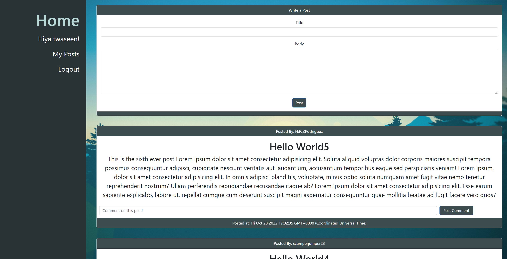

# Toacin's Tech Connect  
  
## Table of Contents  
* [Description](##Description)  
* [Technologies](##Technologies)  
* [Screenshot](##Screenshot)  
* [Installation](##Installation)  
* [Usage](##Usage)  
* [License](##License)  
* [Questions](##Questions)  

## Description

This full-stack web application is a user based blogpost site, with the fullsuite of typical blog-site features. On application load-up, user's are greated with the home page, which displays posts made by users of this site. Each post also includes comments associated with that post, as well as timestamps of said post. To create your own posts however, you must either sign up for an account, or log in if an account already made. From there, the application allows users to make posts, as well as comment on other people's posts. The "My-Posts" tab allows you to view your own posts specifically, as well as intuitively allowing you edit those posts.

### Technologies

Being a full-stack application, this has been my biggest endeavor yet with merging as many technologies possible to make this application functional. The following breakdown is all of the technologies used:  
* Node.js
* SQL Database
* MYSQL
* Sequelize
* Session
* Express
* Handlebars (as an HTML generator engine)
* JAWSdb for Heroku deployment

### Future Development

This application will eventually host a much more expansive suite of blog-post features.

## Screenshot

### Homepage

---

## Installation

N/A visit deployed page to view site.
If running

Installation instructions: `npm i`   
On MySQL CLI: run `SOURCE db/schema.sql`  
On CLI: run `npm run seed`  
Create an .env file in the root directory with four variables with your respective credentials: `DB_NAME='database name'` `DB_USER='user name'` `DB_PASSWORD='SQL password'` `SECRET = 'anything'`  

## Usage

In Windows Command Processor/Terminal, run `node server.js` after running through installation to start server, and visit localhost:3001 to start application

## License

No license

---

## Questions

If you have any follow up questions, feel free to reach out at toacinp@gmail.com  
GitHub: https://www.github.com/Toacin
